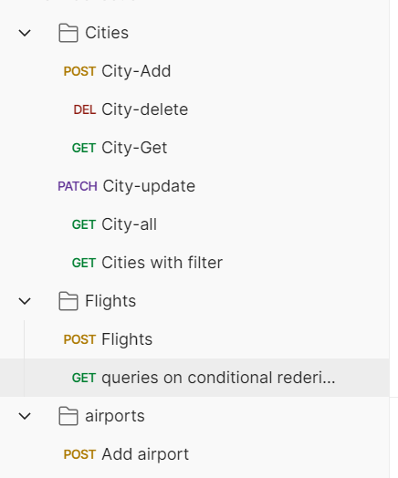

### Welcome to Airline Backend System

## Design Docs

# Objective:
We need to build a backend system that can support different features for an airline company. Our end user is going to be someone who wants to book flights and query about flights so we need a robust system to actually help them give the best experience possible. This doc is solely going to focus on the backend part of the system. We want to prepare the whole backend keeping the fact in mind that the code base should be as maintainable as possible.

# Requirements:
- A user should be able to search for flights from one place to another.
- User should be able to mention the source and destination details
- User should be able to select the date of the journey
    - [V2] User should be able to search for return flights and multi city flights
- User should be able to select the class of the flights [Non mandatory]
- User should be able to select the no of seats they want to book [Non Mandatory]
- Now based on the above data, we will list down the flights
- We should show our users the best available flights at the top based on time period of flight and then based on the price.
- We need to support pagination so that we can list chunk of flights at one point of time.
- We should support filters of flights based on Price, Departure time, Duration, Airline, Stops.
    - [V2] we can add support for more filters
- A user should be able to book a flight considering that user is registered on the platform.
- Tracking flight prices should be possible, the user should be notified about any price
drops or any delays.

- User should be able to list their previous and upcoming flights
- User should be able to download Boarding pass if they have done online check-in
- Online check in mechanism should be supported
- Notifications via email for completing online check-in before 3 hours of departure.
- Notifications to users about any flight delay.
- Users should be able to review the flight journey if and only if they have booked a flight.
- Review mechanism should involve star rating along with a comment.
- While listing any flight we should also display the review of the flight.
- User should be able to authenticate to our system using email and password [V2] Support ticketing, where user can raise their queries.
- Listing FAQ which will be static data
    - [V2] prepare seat selection
    - [V2]Coupons for discounts and offers


# Non Functional Requirements:
- We can expect that we are going to have more flight searches than flight bookings.
-
The system needs to be accurate in terms of booking.
- Expect that we will be having approx 1,00,000 total users, 5,00,000 bookings might come up in one quarter.
- So in one day we can expect 5000 bookings.
- System should be capable of scaling up to at least 3x the current estimated traffic.


# Capacity Estimation
- Storage estimates -
- For the upcoming 5 years, 80,00,000 bookings, 2,00,000 Users, Considering all the users records and booking records take 10 MB of data, the overall 10 TB of memory should be fine for our initial pilot run.
- Traffic estimates - If we consider 30:1 as the search: booking ratio, then at max we expect 150000 search queries a day. 2 query/s


### ER Diagram


## Project Setup
- clone the project on your local
- Execute `npm install` on the same path as of your root directory of teh downloaded project
- Create a `.env` file in the root directory and add the following environment variable
    - `PORT=3000`
- Inside the `src/config` folder create a new file `config.json` and then add the following piece of json

```
{
  "development": {
    "username": <YOUR_DB_LOGIN_NAME>,
    "password": <YOUR_DB_PASSWORD>,
    "database": "Flights_Search_DB_DEV",
    "host": "127.0.0.1",
    "dialect": "mysql"
  }
}

```
- Once you've added your db config as listed above, go to the src folder from your terminal and execute `npx sequelize db:create`
and then execute

```
npx sequelize db:migrate`
```


## DB Design
  - Airplane Table
  - Flight
  - Airport
  - City 

  - A flight belongs to an airplane but one airplane can be used in multiple flights
  - A city has many airports but one airport belongs to a city
  - One airport can have many flights, but a flight belongs to one airport


  
## Tables

### City -> id, name, created_at, updated_at
### Airport -> id, name, address, city_id, created_at, updated_at
    Relationship -> City has many airports and Airport belongs to a city (one to many)
```
npx sequelize model:generate --name Airport --attributes name:String,address:String,cityId:integer
```




## other Serices
- [Auth service](https://github.com/anuragdw710/Auth)
- [Booking service](https://github.com/anuragdw710/Booking)
- [Reminder service](https://github.com/anuragdw710/Reminder) 
- [API GateWay](https://github.com/anuragdw710/gateway)